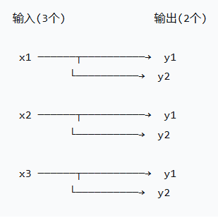
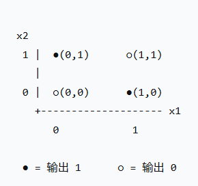
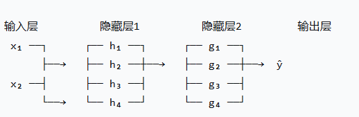

# 序列转导模型与前馈神经网络（FNN）

> **名词约定（重要）**
>
> 本文中 **FNN** 泛指"前馈神经网络"这一大类架构（Feedforward Neural Network）；而 Transformer 内部那个逐位置的前馈子层，按论文惯例记作 **FFN**（Feed-Forward Network）。二者只差一个字母，含义并不相同，阅读时请勿混淆。

---

## 一、什么是序列转导模型（Sequence Transduction Model）

序列转导模型是把一个序列映射成另一个序列的模型。它处理的是序列数据：输入 $x = (x_1, \dots, x_m)$，输出 $y = (y_1, \dots, y_n)$，其中 $m$ 和 $n$ 可以不相等，而且两个序列的元素之间**没有预先给定的对齐关系**。

> **注释：什么是序列数据？**
>
> 序列数据就是具有顺序关系的数据，每个元素的顺序对于数据的整体含义非常重要。

典型的序列转导任务：

- **文本翻译**：翻译前的文本（"How are you"）→ 翻译后的文本（"你好吗？"）
- **文本生成**：用户的输入文本（"How are you"）→ AI 生成的回复文本（"I'm fine, thank you."）
- **语音转文字**：一个音频片段 → 该音频的文字转写

序列转导的难点主要在于 $m \neq n$ 是常态而并非例外情况。例如中译英时一句话 10 个词变 15 个词，语音识别里 3 秒音频变 8 个汉字，都是正常情况。对齐关系是隐变量（latent），哪个输入片段对应哪个输出片段完全无人标注，模型必须自己探索。这既是整个领域的核心困难，也是序列转导区别于序列标注的根本点。

> **注释：序列标注（Sequence Labeling）**
>
> 输入输出全部是等长序列，一一对齐（例如词性标注、命名实体识别，每个词对应一个标签）。

需要说明的是，在《Attention Is All You Need》的语境下，"序列转导模型"指的是当时主流的 **RNN / CNN 编码器–解码器模型**，其中表现最好的那些还会用注意力机制把编码器和解码器连接起来。论文本身并没有为这个词下定义，它沿用的是文献中的通行用法。

---

## 二、前馈神经网络：Feedforward Neural Network (FNN)

### 1. 什么是前馈神经网络

"前馈"（feedforward）描述的是信息流动方向：数据从输入层进入，逐层向前传播，最终到达输出层，全程没有回路、没有反馈边。用图论的话说，计算图是一个有向无环图（DAG）。（MLP 在此基础上还要求相邻层之间全连接，见下文 ④。）

凡是含环的（RNN、带反馈的连接）就不叫前馈网络。这一条看似朴素，但它决定了 FNN 的两个根本性质：

- **推理是纯函数**：$y = f(x)$，同一个输入永远给同一个输出，没有内部状态。
- **输入维度固定**：网络结构在建模时就定死了，$x$ 必须是固定长度的向量。

FNN 的思路是：不告诉它规则，只给它大量"输入 → 正确答案"的例子，让它自己把规则学出来，以应对输入和输出太过庞大的情况。

FNN 的一些同义 / 近义名字：

| 名称 | 全称 | 侧重 |
| --- | --- | --- |
| FNN | Feedforward Neural Network | 强调无环拓扑 |
| MLP | Multi-Layer Perceptron | 强调"多层感知机"的历史渊源 |
| DNN | Deep Neural Network | 泛指深层网络；与 CNN/RNN 并列时特指全连接深层网络 |
| 全连接网络 | Fully-Connected Network / FC | 强调每层是稠密连接 |
| FFN | Feed-Forward Network | Transformer 里特指那个逐位置子层（与泛指架构的 FNN 不是一回事） |

> **注释：表格中名称的简单解释**

#### ① 全连接层 / 全连接网络

神经网络里最基本的**层类型**，假设它共有 3 个输入、2 个输出。



图中每个输入都连接到每一个输出，一共 6 条线，对应 6 个权重（此外还有 2 个偏置，下一节会讲到）。这就是"全连接（Fully-Connected, FC）"的含义。"全连接"描述的是一层里面线的连接方式，因此针对的是"层"，而不是整个神经网络。

#### ② MLP（多层感知机）

几个全连接层堆叠在一起得到的东西。

MLP 名字来源于 1958 年一个叫"感知机"（Perceptron，Rosenblatt 提出）的老机器，它能够根据多个输入（线索）加权计算（推理过程）得到结果，再根据结果与门槛推理输出 0 或 1 的结果，本质上是在空间里通过画一条直线的方式将事件分类（仅是两类！）。而"多层感知机"真正变得实用，则是 1986 年反向传播算法推广之后的事。

单层感知机永远无法解决异或（XOR）问题，又或者说是一条直线无法分类的问题，对应的解决方法就是将多层感知机堆叠，也就是 MLP——多层感知机。

#### ③ 异或（XOR）问题

举例说明调休——"是周末"但算工作日，"是工作日"但是周末。单看"周几"没法判断，必须两个信息交叉着看。这就是 XOR 的味道。它的两个"正确"在平面上是对角线排的，无法通过一条直线切开，因此单层感知机永远学不会。



#### ④ FNN（前馈神经网络）

一种"不停走在一条不回头的路，没有走到终点就绝对不认输"的结构。MLP 是 FNN 的一种，MLP 就是全连接版的 FNN。FNN 仅规定了数据从输入到输出只能往前走，而 MLP 还规定了相邻层间全连接。

#### ⑤ DNN（深度神经网络）

就是层数多的神经网络。需要注意它在两种语境下的用法：泛指"深度神经网络"时，它涵盖 CNN、RNN 等；而与 CNN/RNN 并列使用时，它往往特指"全连接的深层网络"。

#### ⑥ FFN（Feed-Forward Network）

本质就是一个两层的 MLP，是 Transformer 里面一个小的 MLP 零件。叫它 feed-forward，首先是因为它的结构本身就是前馈的——两层线性变换，中间夹一个 ReLU，并且对每个位置独立、相同地施加：

$$\mathrm{FFN}(x) = \max(0,\; xW_1 + b_1)\,W_2 + b_2$$

论文里它的名字是 "position-wise feed-forward networks"，输入输出维度 $d_{\text{model}} = 512$，中间层维度 $d_{ff} = 2048$。换个角度看，它也等价于两个卷积核大小为 1 的卷积。

---

### 2. FNN 的核心零件——一个神经元在做什么

神经元是 FNN 的最小单元，它的工作只有两步：

#### ① 加权求和（打分）

把收到的每个输入乘以一个权重再加起来，最后加一个偏置。

$$z = w_1x_1 + w_2x_2 + \cdots + w_nx_n + b$$

$x$ 是输入，$w$ 是权重（要学的参数），$b$ 是偏置。

简要解释：权重就是这个输入有多重要，偏置就是这个神经元的门槛高低。

#### ② 激活函数

把 $z$ 塞入一个非线性函数。

$$a = f(z)$$

- $z$ 只是个分数，而激活函数负责把它变成更加直观的东西（比如 0~1 之间的概率，或者"负的就归零"）。

把 ① 和 ② 合起来就是一个神经元，FNN 就是把大量这样的神经元堆成几层。

---

### 3. FNN 网络整体长什么样



- **输入层**：只是"接收数据"，不做计算（所以数层数时通常不算它）
- **隐藏层**：真正干活的地方，负责从数据里提取特征
- **输出层**：给出最终结果（分类的各类概率、回归的数值）

**为什么多层比一层强？** 一层只能画出"一刀切"的分界线；多层堆起来可以组合出非常复杂的形状。可以粗略理解成：第一层看局部细节，第二层把细节拼成部件，第三层把部件拼成整体概念。（这个说法最初来自 CNN 的可视化研究，用在 MLP 上只是一种类比。）

---

### 4. 数学部分

#### ① 一层的前向计算

把上面单个神经元的公式写成矩阵形式，一层就是：

$$z = W \cdot x + b$$
$$a = f(z)$$

- $W$ 是权重矩阵，$x$ 是输入向量，$b$ 是偏置向量
- 一行 $W$ 对应一个神经元，矩阵乘法就是"把一层里所有神经元的加权求和一次性并行算完"

#### ② 整个网络

$$
\begin{aligned}
a_1 &= f(W_1 x + b_1) && \text{第一层} \\
a_2 &= f(W_2 a_1 + b_2) && \text{第二层} \\
\hat{y} &= \mathrm{softmax}(W_3 a_2 + b_3) && \text{输出层（多分类用 softmax，二分类用 sigmoid）}
\end{aligned}
$$

这就是前向传播（forward propagation）：输入进去，结果出来。

#### ③ 如何发现错误？如何修正错误？

使用损失函数（loss）衡量预测和真实答案的差距，预测越接近正确答案 loss 越小；反之越大。

想要修正错误也很简单，通过梯度下降的方式慢慢调整权重，观察 loss 对每个权重微小变化的敏感程度，不断向着让 loss 变小的方向缓步前进。

$$w \leftarrow w - \eta \cdot \frac{\partial L}{\partial w}$$

- $\dfrac{\partial L}{\partial w}$ 是梯度，表示"$w$ 增大一点，loss 的**变化率**是多少"
- $\eta$ 是学习率，控制每次挪多大一步（太大容易跳过最优解，太小学得慢）

梯度的计算主要通过反向传播（backpropagation）的方式，它是链式法则的工程体现。loss 是最终的错误，我们从最后一层往回追责——"这个错误里，输出层该负多少责任？再往前，隐藏层各负多少？"一层层把责任（梯度）分回去。分完了，每个权重都知道自己该往哪调。

主要流程如下：

```
前向传播算预测 → 算 loss → 反向传播算梯度 → 更新权重 → 重复
```

重复足够多的轮数（epoch），网络就学会什么权重能达成最终目标了。

---

### 5. 激活函数的意义

如果不用激活函数（或者只用线性函数），多层网络会退化成一层——因为"线性函数的线性组合还是线性函数"，堆 100 层也没用。

特别讲解，这并不是线性函数本身的原因。线性回归是单层线性模型；逻辑回归同样只有一层——它的 sigmoid 只作用在输出上，决策边界仍然是线性的——两者都十分有用。真正的问题在于"**堆叠线性层**"这个行为是没有意义的：堆叠 300 万亿层也和 1 层没有任何区别，这样得到的深度是假的。

从几何的角度来说，线性变换对空间的影响只有旋转、缩放、错切（比如把方形推成平行四边形）、反射（镜像）；再加上 bias 带来的平移，合起来叫**仿射变换**。这些操作都有一个共同特点：直线还是直线，平行还是平行，平面还是平面。所以这就回到了上文单层感知机的缺陷——一个线性分类器所能画出的决策边界，永远只是一条直线（高维下顶多变成超平面）。

非线性的意义在于：它能够让神经网络在训练过程中自己"折"出分类需要的拐点，让决策边界不再被锁死成一条直线，从而更加精巧自主地完成分类工作。

话题回到激活函数。神经网络的名称我们都知道来自动物的神经传导，在我们的大脑里有数不尽的神经元，它们需要一种名为"神经递质"的物质来激活它们完成响应工作，当大量信号传导至神经元时，它才会"啪"地放电，将信息传导至下一个神经元。

激活函数就是把这样的一个规则写成了一个公式，将接受到的不同信息变成不同的信号传导至下一个神经元。神经网络能学会各种形状，并不是因为它聪明，而是激活函数为它提供了足够多的"折点"（对 ReLU 这类分段线性激活而言；sigmoid、tanh 是光滑的，没有折点）。

---

### 6. FNN 的完整流程

任务：根据「学习时长、出勤率」预测「是否通过」。

- **前向**：输入 $[8, 0.9]$ → 隐藏层加权求和 → ReLU → 输出层算出一个概率 0.62
- **算损失**：真实答案是"通过"（1.0），预测 0.62，交叉熵给出一个误差值
- **反向**：梯度回传，发现"学习时长"的权重应该调大一点（它对通过贡献大）
- **更新**：所有 $w$ 和 $b$ 往正确方向挪一小步
- **重复**：拿下一个样本 / 下一批样本，再来一轮

跑够轮数后，再给个新学生 $[6, 0.75]$，网络就能给出预测了。

---

### 7. FNN 的优点和局限性

**优点：**

- 结构简单，容易理解和实现，是入门深度学习的最佳起点
- 理论上是"万能近似器"：只要隐层足够宽、激活函数非线性，就能在**有界闭集（紧集）上**以任意精度逼近任意连续函数。不过要注意，定理只保证"存在这样一组权重"，并不保证梯度下降一定能把它们训练出来
- 对表格类数据（结构化数据）效果往往很好

**局限：**

- **参数量爆炸**：输入 1000 维、隐藏层 1000 个神经元，一层就 100 万个权重
- **不利用空间结构**：图片展平成一维向量后，模型没有"相邻像素相关"这个先验，同一个特征出现在图像不同位置都要各自学一套权重，只能靠海量数据硬学 → 所以有了 CNN（局部连接 + 参数共享）
- **不利用顺序结构**：每个位置各自一套权重，无法跨位置共享，也吃不下变长序列 → 所以有了 RNN / Transformer
- **容易过拟合**：参数太多，容易死记硬背训练数据（常用 Dropout、正则化缓解）

---

## 参考资料

- Vaswani et al., *Attention Is All You Need*, NeurIPS 2017. <https://arxiv.org/abs/1706.03762>
