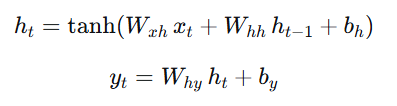
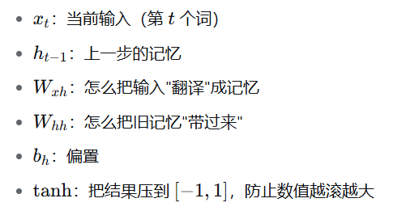
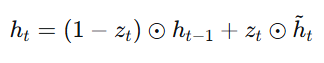

# 循环神经网络——Recurrent Neural Network（RNN）

## 一、什么是循环神经网络（RNN）？

普通的神经网络（比如全连接网络）有个硬伤：**它每次只能看一个孤立的东西**。

假设你想做一个“情感判断”模型，输入是这句话：

“这部电影**不**好看”

如果你把每个词单独喂给普通网络，它会看到“好看”→正面情绪，结果判断成“好评”。它完全不知道前面有个“不”字。

问题在于：**语言、语音、股价、天气……这些数据都是有顺序的**。第 5 个词的意思，往往取决于前 4 个词。这类数据叫**序列数据（sequence data）**。

RNN（Recurrent Neural Network，循环神经网络）就是为了解决这个问题发明的。

要是想记住任意长的历史只有一种做法——同一个更新规则反复用。RNN 在处理每一步时，会带上一份“对之前所有内容的记忆摘要”。

这份记忆摘要叫**隐藏状态（hidden state）**，通常记作 `h`。

你可以把 RNN 想象成一个人在**逐字读书**：

- 读到第 1 个字，脑子里有一些印象 → 记下来，叫 `h1`
- 读到第 2 个字，他不会把第 1 个字忘了，而是**结合旧印象 + 新字**，更新印象 → `h2`
- 读到第 3 个字，继续更新 → `h3`
- ……

**同一个“读书的人”（同一套参数）被反复使用**，这就是 “Recurrent（循环/复用）” 的含义。

这种处理方式带来三个好处：

#### ① 参数量跟句子长度无关

不管句子 10 个字还是 1000 个字，参数一样多。所以训练时见过短句，测试时也能处理长句。

#### ② 能处理变长输入

这是 FNN 做不到的，FNN 输入维度是写死的。

#### ③ 学到的是“通用的阅读方式”

而不是“第 3 个位置该怎么处理”这种死记硬背。所以它能把在短句上学到的规律迁移到长句。

---

## 二、RNN 的核心公式

### 1. 隐藏状态更新：新记忆



第一行：新记忆 = 压缩（新输入的信息 + 旧记忆的信息）

### 2. 产生输出：从记忆到输出



第二行：把当前的记忆 `h_t` 加工成我们要的输出。

**这三个 W 在所有时间步是同一套**。这就是 RNN 参数量少、能处理任意长度序列的原因。

初始化时 `h0` 通常是全零向量。

---

## 三、RNN 的训练过程

### 1. 前向传播与反向传播

RNN 的训练由两部分组成：

前向：从第 1 个词读到第 T 个词，一路更新本子，最后算出预测和误差。

反向：从最后的误差出发，**沿时间倒着往回走**，问每一步：“你当时那个决定，对最后的错误负多少责任？”然后按责任大小调整参数。

反向训练叫做 BPTT（BackPropagation Through Time，沿时间反向传播），就是把链式法则用在一条很长的链上。

---

### 2. 链式法则

链式法则（Chain Rule）：**复合函数的导数 = 外层函数在里层取值处的导数 × 里层函数的导数。** 它解决的是“函数套函数”怎么求导的问题。那么为什么说反向传播（backpropagation）本质上就是链式法则的高效实现呢？

链式法则本身：沿路相乘、沿路相加。反向传播做的事：把这个“求和”结果倒着做，并且发现同一个中间量的“放大倍数”会被很多条路共享，所以只算一次就够了。就好比通过链式法则求两个不同复合函数的导数过程中发现，虽然前边这两个函数的复合方式不一样但是后边的都一样（当然也可能是前面），后边的就不用再算了直接用前面的就行。

但具体来说，反向传播做的更“聪明”，以下是具体解释。

---

### 3. 反向传播（BPTT）

#### （1）为什么要进行反向传播？

RNN 的前向传播，就是在不看答案、不回看历史的前提下，用「当前输入 + 上一步隐状态」沿时间逐步把变长序列折叠成一个定长隐状态，从而边读边形成上下文记忆、并逐时刻产生输出。

反向传播（BPTT）做的事就是从头追溯到过去，给每一步的决定打分，并把这些分数累加起来，变成参数该往哪里调的指令，这是 RNN 学会迁移经验的机制。假设输入是 W，最终的输出是 L，简单来说反向传播的目的就是——“如果我把 W 稍微调动一下，L 会改变多少？”。

把这个过程延长到每一层，如果我们想要研究第 k 层对于最终结果的影响，我们只需要观察 k+1 一直到最后一层的梯度，而不需要观察 k-1 层以及之后的梯度。也就是说第 k 层的梯度只与它之后层的梯度相关。

所以“谁先算”是一定的——必须是后面的先算。

梯度的意义实际上就是通过导数观察某一步对于最终结果的影响（从最终结果，也就是复合导数的最外层开始，一步一步求导直到目标层，通过最终拆分完毕的导数，观察这一步对于最终结果的影响幅度，也就是“导数的意义”），也就是链式法则的体现。

那为什么说反向传播是链式法则的**“高效实现”**呢？这是由于实际需要导致的。

在实际场景中，一次 RNN 的最终输出只有一个，但是中途的输入由层数来决定，我们的研究对象也是每一步对于一个最终输出的影响。因此，只要通过一次反向传播，我们就能得到每一步对于最终输出的影响，并且可以对计算进行复用。

假设我们一个 RNN 有四层，我们需要研究第一层对于最终结果的影响，从导数的角度来说我们需要研究 C4/C1（导数符号省略）。

如果通过前向传播，C4/C1 = C4/C3 × C3/C2 × C2/C1。

在 RNN 的过程中，我们已经在前向计算的过程中保留各个位置的局部导数，也就是像 C3/C2、C2/C1 这样的东西，也就是我们只需要计算 C4/C2 的结果。

到此为止，我们现在来研究第二层对于最终结果的影响，也就是 C4/C2。

通过前向传播 C4/C2 = C4/C3 × C3/C2。

在这个过程中我们会发现 C4/C3 被计算了两次，如果 RNN 的链条持续拉长，那么重复计算的损耗只会更大。

而对于反向传播：

对于 C4/C3，不用计算属于局部导数；C4/C2，只需要将 C4/C3 与局部导数相乘即可；C4/C1，只需要将 C4/C2 与局部导数相乘即可。

我们可以明显地看出反向计算没有重复计算而且可以大量复用已有内容。而对于前向计算，假设我们需要观察第 n 层的影响，一共有 N 层，我们总需要计算 CN/C（n-1）的大小。

所以对于梯度的计算，反向传播远优于正向传播。

但是在反向传播的过程中，我们每一次倒推都会乘一次相同的权重，由此产生的问题便是，一旦某个数反复乘以同一个数太多次往往只有两个结果——要么趋近 0，要么爆炸。

---

### 4. 梯度消失与梯度爆炸：RNN 记性不好的原因

从具体数字的角度看。

假设往回传的时候，每步的“衰减系数”是 0.9（这已经算很温和了）：

| **往回传多少步** | **信号还剩多少** |
| --- | --- |
| 10 步 | 0.35 |
| 20 步 | 0.12 |
| 50 步 | 0.005 |
| 100 步 | 0.000027 |

100 步之前的信号，**衰减到几乎为零**。

反过来，如果系数是 1.5：

| **往回传多少步** | **信号变成** |
| --- | --- |
| 10 步 | 58 |
| 50 步 | 6.4 亿 |
| 100 步 | 4×10¹⁷ |

直接爆掉。

**所以只有系数恰好等于 1 才能稳定传播。** 但每步的系数是模型学出来的，让 100 个系数全都精确等于 1，概率几乎为零。而且别忘了还有 tanh 的导数——它大部分时候小于 1，**主动往衰减那一边推**。

这导致模型会像鱼一样经过一段时间就忘记曾记过的内容，因为代表前部分信息的信号已经被逐层衰减到太过微小，以至于根本无法对判断当前内容产生影响，于是它学不会建立长距离联系，模型的训练信号根本传不到那么远。

有些人会误解 RNN 的问题是维度不够导致一个向量存储的信息不够。我们可以把 RNN 的维度想象成笔记本的一页，而把 RNN 整体想象成一个动态的电子笔记本（如果你懂 context window 的话可以想象成这个），这个笔记本最多五十页，当你记到第五十一页的时候就会自动忘记第一页的内容，把原来的第五十一页变成第五十页，原来第二页变成第一页。

梯度爆炸的处理方式：加上一行 Python 代码

```python
torch.nn.utils.clip_grad_norm_(model.parameters(), max_norm=5.0)
```

原理：如果整体梯度范数超过 5，就**等比缩放**回 5。相当于“不改变梯度的方向，只砍掉它过大的幅度”。这是训练 RNN 的**标配**，几乎所有代码里都有。

---

## 四、LSTM 和 GRU

### 1. LSTM：把记忆分成两条线

普通 RNN 只有一个记忆向量 `h_t`，它同时承担两个职责：

- ① 记住长期信息
- ② 输出给下一步和预测层

LSTM 认为应该把这两个东西拆开，于是将其分成细胞状态和隐藏状态两条线。

|  | **细胞状态 `c_t`** | **隐藏状态 `h_t`** |
| --- | --- | --- |
| 绰号 | 长期记忆、笔记本正文 | 对外发言、工作记忆 |
| 作用 | 长期存放信息 | 拿出去用（预测、传给下一层） |
| 更新方式 | **加法为主** | 由 `c_t` 过滤后得到 |
| 比喻 | 笔记本里写下的内容 | 此刻张口说出来的话 |

细胞状态是 LSTM 的灵魂所在，它就像一条**信息传送带**，从序列开头一直延伸到结尾，沿途只做小幅的增删，不做剧烈的重写。梯度沿着这条传送带回流时几乎不衰减——这就是 LSTM 能记住几百步的根本原因。

而隐藏状态是指从 LSTM 这个笔记本里挑出来的、当前要用的那部分。

细胞状态并不直接参与预测过程，预测用的是隐藏状态。可以把细胞状态简单理解成仓库，而隐藏状态是需要输出时向这个仓库取货的过程。

原来 RNN 会遗忘远距离内容的原因，是因为在每次传递过程中多次乘以同一个数导致的梯度消失。在 LSTM 的细胞状态里，细胞状态的更新方式由“纯乘法”改为“门控乘法 + 加法”，新增了一条以加法为主的通路：

**新长期记忆 = 旧长期记忆 × 遗忘门的输出 + 候选内容 × 输入门的输出**

加法在反向传播时**不改变信号的量级**（当遗忘门接近 1 时，这条通路的导数也接近 1），所以梯度可以沿着这条传送带**跨越几十上百步而不衰减**。这就是 LSTM 的“信息高速公路”。普通 RNN 没有这条路，所有信息都得走“乘法”那条拥堵小路。

---

### 2. 三扇门：遗忘门、输入门、输出门

LSTM 中的三扇门：遗忘门、输入门、输出门。

#### （1）遗忘门

读到新内容时，先审视旧笔记：哪些过时了、无关了？撕掉。（例子：读完“但是”这个词，前面那些正面记录可以准备作废了）。计算方法是看当前输入和当前状态，对记忆的**每一个格子**给出一个 0~1 的擦除系数。

这个行为是模型自己学会的。没人告诉它要在哪里清空记忆，需要模型在训练过程中自主形成习惯。

**一个重要的初始化技巧**：训练开始时，遗忘门如果偏向“关”（输出接近 0），模型一上来就把记忆全擦了，很难学好。所以实践中会把遗忘门的偏置**初始化成正数**（比如 1），让它初始状态偏向“记住”。LSTM 的发明者后来专门写过一篇论文讲这件事，可见其重要性。

#### （2）输入门

判断当前听到的内容重不重要。重要的才写进笔记，废话不写。

这个门由两部分组成：

- ① 候选内容（写什么）：用一个 `tanh` 层算出“如果要记，应该记成什么”。它的输出范围是 **-1 到 1**，因为记忆需要能表示负面信息（比如“负面情绪 -1”）。
- ② 写入强度（记多少）：用一个 `sigmoid` 层算出每个格子的写入系数，0~1。

分成两部分的原因是“候选内容”和“要不要写”实际上是两件独立的事。例如当你看到一家店下面的评论是“这家店听说很难吃”，模型首先会看到候选内容是“负面情绪”，同时对其进行判断，识别“听说”表示“不确定”、“信息可能不可靠”这种差别。如果仅用一层，模型就没办法表达出这种怀疑态度。

#### （3）输出门

LSTM 的笔记上写了很多，但此刻回答问题时**只挑相关的说**，不必全盘托出。（例子：预测动词时，翻到“主语是复数”那页，其他页先不管）。输出门看着当前状态，决定从长期记忆里取出哪些部分作为当前的隐藏状态 `h`。

**当前发言 h = tanh(长期记忆 c) × 输出门的输出**

**顺带一提**：`c` 先过一遍 `tanh`（压到 -1~1），再乘输出门。为什么压？因为 `c_t` 是长期累加出来的，值可能很大，不压一下会影响后续计算。

三个门都是用 `sigmoid` 算出来的 0~1 之间的数，含义就是“开多少”。0.9 就是“基本全开”，0.1 就是“基本关掉”，而且这三个门的参数不由人设定，模型会在训练过程中自动发现三个门的参数该如何调整。

---

### 3. 为什么 LSTM 可以防止梯度消失？

RNN 中梯度沿时间反向传播时，会经过细胞状态这条线，形式大致是：

**梯度传回来时，主要乘的是“遗忘门的值”，而不是一堆权重矩阵**

对比一下：

|  | **普通 RNN** | **LSTM** |
| --- | --- | --- |
| 回流经过什么 | 每步乘一个权重矩阵 | 每步乘一个“遗忘门的数” |
| 衰减由什么决定 | 特征值可能远小于 1，**指数衰减** | 遗忘门由模型自己控制 |
| 关键差别 | 模型没法控制衰减 | **模型可以学会把它保持在接近 1** |

**遗忘门的值是模型自己学的。如果某个信息确实需要记住 200 步，模型可以学会让遗忘门在那里保持接近 1，梯度就能一路传回去。**

在普通 RNN 里没有这个可调阀门，衰减是结构性的。不过 LSTM 的记忆也不是无限的，遗忘门总归会输出小于 1 的值，在历经几百步过后仍会衰减。这也是后续 Transformer 产生的原因。

---

### 4. GRU：LSTM 的精简版

GRU 在 LSTM 的基础上将细胞状态 `c` 和隐藏状态 `h` 合二为一，只保留一个状态 `h`，把它同时当作长期记忆和对外输出。让参数变少、实现更简单、计算更快，而代价仅仅是在实践中区别不大的一点灵活性。

GRU 还将遗忘门和输入门合并为更新门。GRU 认为“擦除旧记忆”和“写入新记忆”是互补的操作，多记一点新的就少留一点旧的，只用一个门就够了。

**新记忆 = 旧记忆 × (1 - 更新门) + 候选内容 × 更新门**

更新门接近 0 ＝ 保留更多旧记忆；接近 1 ＝ 写入更多新记忆。

重置门：决定参考多少旧记忆来计算新内容。它不会删除信息，只是让旧记忆在这次计算中暂时不起作用，旧记忆本身完好无损，下一刻该用还是能用。

GRU 每一步的计算有四小步，重置门出现在第二步：

- ① 更新门 `z_t = σ(...)`
- ② 重置门 `r_t = σ(...)`
- ③ 候选内容 `h̃_t = tanh( W·x_t + r_t ⊙ (U·h_{t-1}) )` —— 重置门在这里起作用
- ④ 最终记忆 `h_t = (1-z_t)⊙h_{t-1} + z_t⊙h̃_t`

重置门就是旧记忆在新内容上的闸门，是一个关于“旧记忆影响力度”的旋钮，重置门值越小，候选内容越专注于当下。当重置门完全关闭时（重置门等于 0），相当于模型完全从零开始重新理解当前输入，这个性质在“话题突然切换”时经常使用。

以两个例子来说明重置门开关幅度的实际意义：

#### ① 话题切换（重置门关闭）

“这家店**环境**很温馨，服务员也很**热情**，**但是**老板的**名字**叫王大明”

在处理最后一句时，模型需要建立“王大明 → 是人名”这个概念。而前面携带的记忆全是“温馨”“热情”（关于氛围和态度的）。

如果重置门开着，`U·h_{t-1}` 这一大坨“氛围信息”就会混进候选内容里，干扰对“人名”的理解。

**理想行为**：读到“但是”和“名字”这类**话题切换信号**时，重置门**关闭**，让候选内容完全基于当前输入来构造，不被旧话题拖累。

这就是前面说的“让旧记忆在这次计算中暂时不起作用”的用处——**给了模型一个“重新开始”的开关**。

#### ② 代词指代（重置门打开）

“这家餐厅我去过，**它**的招牌菜真不错”

要理解“它”，必须回到前文找到“餐厅”。

**理想行为**：读到“它”时，重置门**打开**，让旧记忆（装着“餐厅”这个实体）充分参与候选内容的计算，从而把“它”解析成“餐厅”。

如果重置门在这里关闭了，模型就变成了“只读当前词”——“它”指什么完全不知道，后面全乱。

那么重置门和更新门的区别是什么呢？更新门是控制“保留多少旧记忆”的门，而重置门从上文所见是“使用多少旧记忆”的门，那么它们的区分点究竟在哪，又为什么非要使用两个门呢？

重新回到 GRU 每一步的计算流程来看：

- 第 1 步：更新门 `z_t = σ(...)`
- 第 2 步：重置门 `r_t = σ(...)`
- 第 3 步：候选内容 `h̃_t = tanh( W·x_t + r_t ⊙ (U·h_{t-1}) )`
- 第 4 步：最终记忆 `h_t = (1-z_t)⊙h_{t-1} + z_t⊙h̃_t`

可见在最终记忆的 `h_t` 里并没有 `r_t` 重置门的直接参与，而是在第三步中为最终记忆提供候选内容，再经由更新门进一步决定采纳程度。

总的来说，更新门和重置门都是决定对“新记忆”的采用程度，只不过这个“新”的程度略有不同。重置门决定在这一计算阶段新输入的记忆要吸纳多少内容，做出最终方案后向更新门提出，再由更新门决定对这个新方案到底采纳多少。

你可能还是会想到“如果我们需要在转折处放弃旧记忆，那么直接让 `z_t=1` 从而使旧记忆消失不就得了？”事实确实如此，但在既需要旧信息又需要新信息的场合（例如我们需要保留 0.95 的旧信息的同时写入 0.3 的新信息），在这种情况下仅靠一个 `z_t` 参数就无法达成这种目的，因为这两个量被强制绑定成“和等于 1”，修改一个另一个必然向另一方变化。

**所以更新门决定“要不要改”，重置门决定“能改得多彻底”，这是考虑最完备同时代价最小的设计方式。**

所以直接来说，重置门并不能对 GRU 中的状态 `h`（记忆）产生直接影响，它只负责根据输入提出方案，真正直接修改下一步状态 `h`（记忆）的有且只有更新门。

---

### 5. 从梯度角度理解 GRU 的优势

从讲解 LSTM 与 RNN 的对比我们可以看到，LSTM 的梯度回流主要靠加法，在 GRU 里这条路径是：



这是最终记忆的更新方程式，注意这部分没有重置门参与。所以：重置门不在梯度回流的主高速公路上，更新门才是。

也就是说当 `r_t → 0` 时，候选内容只依赖当前输入 `x_t`。这意味着如果某一步只依赖当前输入，那么往回传梯度时，就根本不需要经过旧记忆这条链，梯度直接走 `x_t` 那条短线回去了。

这样梯度不必穿过一长串容易衰减的乘法路径，直接落到当前时间步的输入权重上，这让模型在“局部依赖”任务上也能快速学好。

所以重置门其实有双重作用：

- ① **前向**：让候选内容不受旧信息污染，支持话题切换和彻底转折
- ② **反向**：给梯度提供一条绕过历史链的短路径

---

### 6. LSTM 和 GRU 的对比

|  | **LSTM 的做法** | **GRU 的做法** |
| --- | --- | --- |
| 保护长期记忆 | 单开一条细胞状态 `c_t`，加法连接 | 没有独立 `c_t`，靠更新门 |
| 输出给外界 | 独立状态 `h_t`，由输出门从 `c_t` 过滤 | 和长期记忆**共用同一个** `h_t` |
| 控制旧信息参与度 | **输出门（从 `c_t` 里取什么）+ 遗忘门** | **重置门（算候选时用多少旧 `h_t`）** |
| 状态数量 | 2 个（`c_t`、`h_t`） | 1 个（`h_t`） |
| 门数量 | 3 个（实际 4 组权重） | 2 个（3 组权重） |

LSTM 的做法更“讲究”：它把“存什么”（`c` 的更新）和“说什么”（`h` 的输出）彻底分离，所以理论上更灵活。GRU 的做法更“经济”：**只有一份记忆**，所以它必须在“算候选”和“更新记忆”这两个环节上分别施加控制，这就分别需要重置门和更新门。

---
